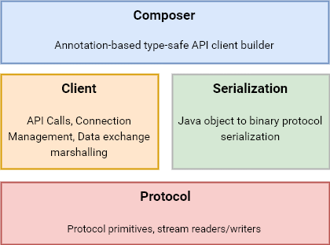

#  pCloud Networking Java

A stack of networking libraries for [ pCloud's API][docs] binary protocol by pCloud AG.

[](https://search.maven.org/search?q=g:com.pcloud.pcloud-networking-java)
[](CHANGELOG.md)
[][docs]

## Requirements

- Java 7.0+
- Android 2.3+ (API9+)

## Documentation

The pCloud API and binary protocol documentation can be found [here][docs].

The library's JavaDoc documentation is posted [here][javadoc].


## Components



### Composer

The `composer` module contains a Retrofit-like adapter library for composing API calls via annotated Java interface declarations.

#### Features

* Declaration of API calls as annotated Java interface methods.
* Automatic serialization and deserialization of objects to the binary protocol.
* Allowance for bulk sending of requests.
* Support for RxJava via extension modules.

#### Example

```java
public interface Api {

    @Method("copyfile")
    ApiResponse copy(@RequestBody CopyFileRequest request) throws IOException;

    @Method("deletefile")
    Observable<ApiResponse> deleteFiles(@RequestBody List<DeleteFileRequest> requests);

    @Method("showpublink")
    Call<ListLinkResponse> listPublink(@Parameter("code") String code);
}

Api api = ApiComposer.create()
                .create()
                .compose(Api.class);
api.copy(...)

```

#### Download

[  ](https://search.maven.org/artifact/com.pcloud.pcloud-networking-java/composer/2.7.0/jar)

```xml
<dependency>
  <groupId>com.pcloud.pcloud-networking-java</groupId>
  <artifactId>composer</artifactId>
  <version>2.7.0</version>
  <type>pom</type>
</dependency>
```

```groovy
compile 'com.pcloud.pcloud-networking-java:composer:2.7.0'
```

### Client

The `binapi-client` module contains a network client for composing and executing binary API requests.

#### Features

* A user-friendly API similar in terms and behavior to OkHTTP.
* Support for request cancellation.
* Connection pooling to improve resource usage and battery life on mobile devices.
* Highly configurable (read/connect/write timeout durations, pool size and idle times, socket factories, host verification strategies and more).

#### Download

[  ](https://search.maven.org/artifact/com.pcloud.pcloud-networking-java/composer/2.7.0/jar)

```xml
<dependency>
  <groupId>com.pcloud.pcloud-networking-java</groupId>
  <artifactId>binapi-client</artifactId>
  <version>2.7.0</version>
  <type>pom</type>
</dependency>
```

```groovy
compile 'com.pcloud.pcloud-networking-java:binapi-client:2.7.0'
```

--------------------------------------------------------------------------------
### Serialization

The `serialization` module contains a library for serializing Java objects to binary protocol primitives.

#### Features

* Familiar API based on field annotations.
* Built-in adapters for the Java primitive types and their boxed variants.
* Support for custom adapters.

#### Download

[  ](https://search.maven.org/artifact/com.pcloud.pcloud-networking-java/serialization/2.7.0/jar)


```xml
<dependency>
  <groupId>com.pcloud.pcloud-networking-java</groupId>
  <artifactId>serialization</artifactId>
  <version>2.7.0</version>
  <type>pom</type>
</dependency>
```

```groovy
compile 'com.pcloud.pcloud-networking-java:serialization:2.7.0'
```
--------------------------------------------------------------------------------
### Protocol

The `protocol` module contains the core logic for writing/reading data in the format defined by the binary protocol.

#### Features

* Stream-based protocol readers and writers based on Square's [Okio library](https://github.com/square/okio).
* Helper classes that allow reading to/writing from `java.util.Map` key-value mappings.
* Support for peeking and non-consuming reads.

#### Download

[ ](https://search.maven.org/artifact/com.pcloud.pcloud-networking-java/composer/2.7.0/jar)

```xml
<dependency>
  <groupId>com.pcloud.pcloud-networking-java</groupId>
  <artifactId>protocol</artifactId>
  <version>2.7.0</version>
  <type>pom</type>
</dependency>
```

```groovy
compile 'com.pcloud.pcloud-networking-java:protocol:2.7.0'
```

## License
	Copyright (c) 2020 pCloud AG

	Licensed under the Apache License, Version 2.0 (the "License");
	you may not use this file except in compliance with the License.
	You may obtain a copy of the License at

    http://www.apache.org/licenses/LICENSE-2.0

    Unless required by applicable law or agreed to in writing, software
    distributed under the License is distributed on an "AS IS" BASIS,
    WITHOUT WARRANTIES OR CONDITIONS OF ANY KIND, either express or implied.
    See the License for the specific language governing permissions and
    limitations under the License.


[site]: https://www.pcloud.com/
[docs]: https://docs.pcloud.com/
[javadoc]: https://pcloud.github.io/pcloud-networking-java/
